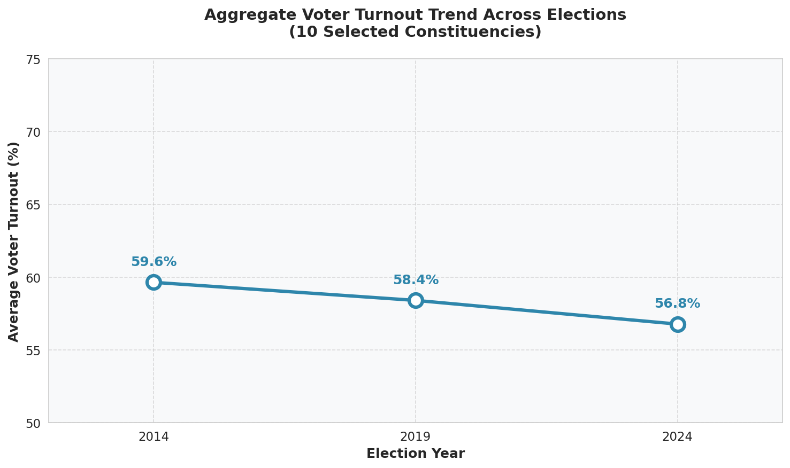
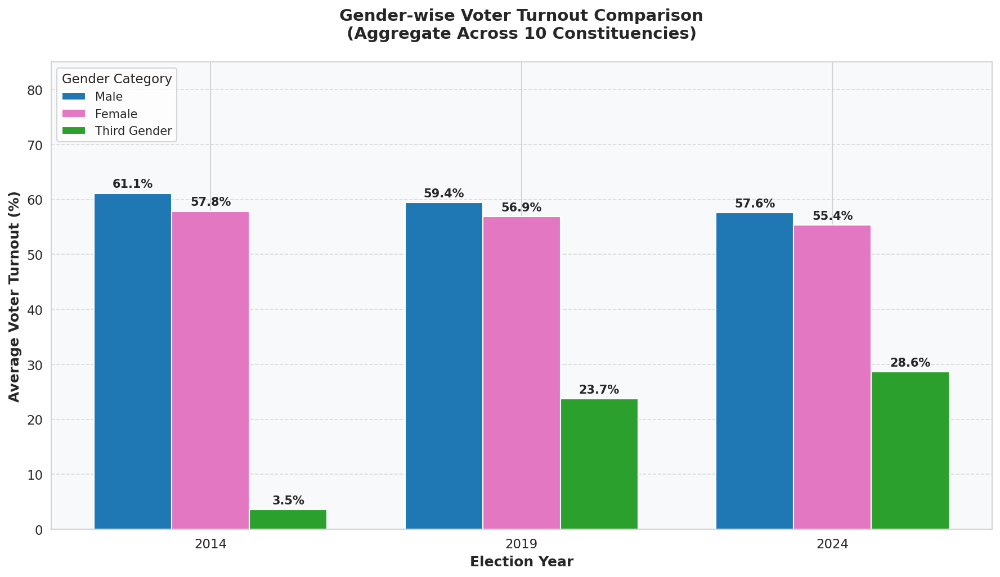
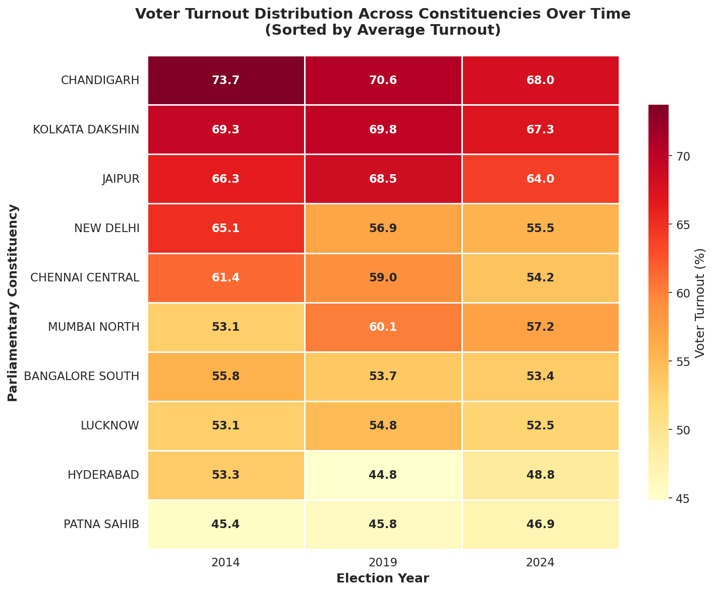
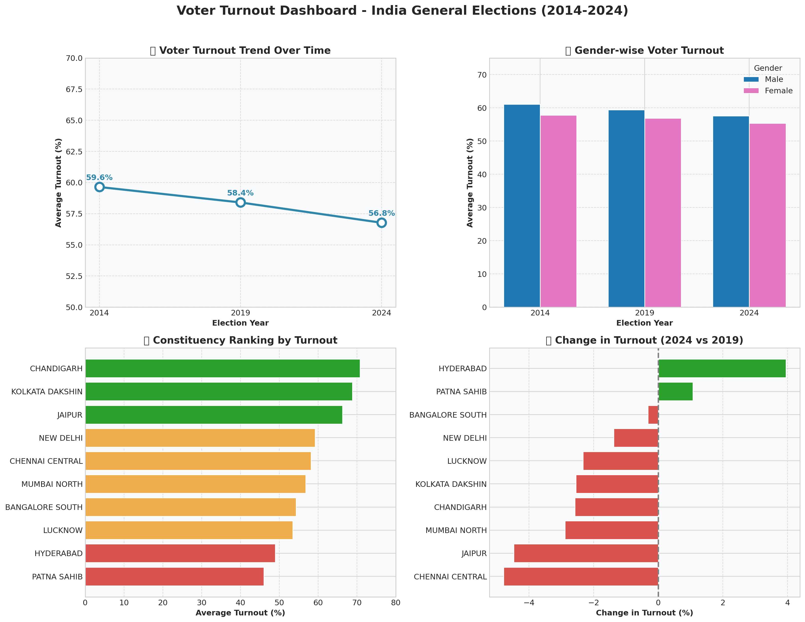

# Data Visualization and Storytelling Assignment

## 📊 Voter Turnout Analysis Dashboard - India General Elections (2014, 2019, 2024)

This project analyzes voter turnout patterns across 10 major Indian constituencies over the last three General Elections, demonstrating effective visualization design principles.

---

## 📋 Project Components

| Component | Description |
|-----------|-------------|
| Task 1: Data Creation | Dataset curation with gender-wise bifurcation |
| Task 2: Visualization Development | Four visualizations demonstrating Gestalt principles |
| Task 3: Dashboard Design | Interactive dashboard with drill-down capability |

---

## 📁 Project Structure

```
├── 01_Data_Exploration.ipynb      # 📌 Task 1: Data curation and exploration
├── 02_Visualizations.ipynb        # 📌 Task 2: Four visualizations with Gestalt principles
├── 03_Dashboard.ipynb             # 📌 Task 3: Interactive dashboard with drill-down
├── cleaned_data/
│   ├── curated_voter_turnout_10_constituencies.xlsx  # 📌 DATA FILE FOR SUBMISSION
│   ├── curated_voter_turnout_10_constituencies.csv
│   ├── viz_a_turnout_over_time.png
│   ├── viz_b_turnout_by_gender.png
│   ├── viz_c_heatmap_constituency_time.png
│   └── dashboard_static.png
├── dataset/                        # Raw source data from ECI
│   ├── 2014/
│   ├── 2019/
│   └── 2024/
└── README.md
```

### 📌 Submission Files
| File | Description |
|------|-------------|
| `01_Data_Exploration.ipynb` | **Task 1** - Data curation with 18 variables |
| `02_Visualizations.ipynb` | **Task 2** - Four visualizations with Gestalt principles |
| `03_Dashboard.ipynb` | **Task 3** - Interactive dashboard with drill-down |
| `curated_voter_turnout_10_constituencies.xlsx` | **Data file** - Curated Excel dataset |

---

## 🗳️ Selected Constituencies (10)

| # | Constituency | State |
|---|-------------|-------|
| 1 | New Delhi | NCT of Delhi |
| 2 | Mumbai North | Maharashtra |
| 3 | Kolkata Dakshin | West Bengal |
| 4 | Chennai Central | Tamil Nadu |
| 5 | Bangalore South | Karnataka |
| 6 | Hyderabad | Telangana |
| 7 | Lucknow | Uttar Pradesh |
| 8 | Jaipur | Rajasthan |
| 9 | Patna Sahib | Bihar |
| 10 | Chandigarh | Chandigarh |

---

## 📊 Task 1: Data Creation

### Data Source
- **Election Commission of India**: https://www.eci.gov.in/statistical-reports
- **Table Used**: PC Wise Voter Turnout (Table 13)

### Data Curation Process
For 2014 and 2019, gender-wise electors were calculated using the formula:
```
Electors_Male = Voters_Male / (Turnout_Male / 100)
Electors_Female = Voters_Female / (Turnout_Female / 100)
Electors_TG = Voters_TG / (Turnout_TG / 100)
```
> **Note**: As per assignment guidelines, the sum of Male + Female + TG may not exactly equal Total Electors due to rounding in turnout ratios.

### Dataset Variables (18 Total)

| Variable | Type | Description |
|----------|------|-------------|
| **Categorical (3)** | | |
| Year | Ordinal | Election year (2014, 2019, 2024) |
| State | Nominal | State/UT name |
| PC_Name | Nominal | Parliamentary Constituency name |
| **Quantitative (15)** | | |
| Electors_Total | Ratio | Total registered electors |
| Electors_Male | Ratio | Male registered electors |
| Electors_Female | Ratio | Female registered electors |
| Electors_TG | Ratio | Third gender registered electors |
| Voters_Male | Ratio | Male votes polled |
| Voters_Female | Ratio | Female votes polled |
| Voters_TG | Ratio | Third gender votes polled |
| Voters_Total | Ratio | Total votes polled (excl. postal) |
| Postal_Votes | Ratio | Postal votes polled |
| Total_Voters | Ratio | Total votes including postal |
| Turnout_Percent | Ratio | Overall voter turnout (%) |
| Turnout_Male | Ratio | Male voter turnout (%) |
| Turnout_Female | Ratio | Female voter turnout (%) |
| Turnout_TG | Ratio | Third gender voter turnout (%) |
| Turnout_Postal | Ratio | Postal vote turnout ratio (%) |

### Data File for Submission
📌 **`cleaned_data/curated_voter_turnout_10_constituencies.xlsx`**
- 30 rows (10 constituencies × 3 years)
- 18 columns (3 categorical + 15 quantitative)

---

## 📈 Task 2: Visualization Development

### Visualization A: Turnout Over Time (Line Chart)
**Purpose**: Show change in voter turnout ratio at aggregate level over time



**Gestalt Principles Applied**:
- **Continuity**: Line connecting data points shows temporal progression
- **Similarity**: Consistent color and marker style
- **Proximity**: Years grouped on x-axis

---

### Visualization B: Gender Comparison (Grouped Bar Chart)
**Purpose**: Show change in voter turnout ratio across genders



**Gestalt Principles Applied**:
- **Similarity**: Same color for same gender across years
- **Proximity**: Bars grouped by year for easy comparison
- **Common Region**: Bars within each year share visual space

---

### Visualization C: Constituency × Time Heatmap
**Purpose**: Show distribution of voter turnout across constituencies and time



**Gestalt Principles Applied**:
- **Similarity**: Color intensity represents turnout percentage
- **Common Region**: Grid structure groups related data
- **Proximity**: Rows (constituencies) and columns (years) create natural groupings

---

### Visualization D: Interactive Gender × Constituency (Bokeh)
**Purpose**: Show distribution of voter turnout across constituencies and genders

**Gestalt Principles Applied**:
- **Similarity**: Color-coded by gender (Blue=Male, Pink=Female, Green=TG)
- **Proximity**: Bars grouped by constituency
- **Interactivity**: Hover tooltips for detailed information

---

## 🖥️ Task 3: Dashboard Design

### Dashboard Features
1. **KPI Cards**: Quick summary metrics (Average Turnout, Total Voters, etc.)
2. **4-Panel Layout**: All visualizations from Task 2 in unified view
3. **Drill-Down Feature**: Constituency selector dropdown for detailed analysis
4. **Interactive Elements**: Bokeh-powered with hover tooltips and selection

### Static Dashboard Preview


### Interactive Dashboard
Run `03_Dashboard.ipynb` to view the fully interactive Bokeh dashboard with:
- Constituency dropdown selector
- Detailed turnout charts by gender
- Time-series analysis per constituency

---

## 🎨 Design Principles Applied

### Gestalt Principles
| Principle | Application |
|-----------|-------------|
| **Proximity** | Related data points grouped together |
| **Similarity** | Consistent colors for same categories |
| **Continuity** | Line charts show temporal flow |
| **Common Region** | Dashboard panels organize related visuals |
| **Figure-Ground** | Clear contrast between data and background |

### Color Schema
| Element | Color | Hex Code |
|---------|-------|----------|
| Male | Steel Blue | `#4682B4` |
| Female | Hot Pink | `#FF69B4` |
| Third Gender | Sea Green | `#2E8B57` |
| Overall Trend | Dark Blue | `#1f77b4` |
| Accent | Orange | `#ff7f0e` |

### Best Practices
- ✅ Clear axis labels and titles
- ✅ Appropriate chart types for data
- ✅ Consistent formatting across visuals
- ✅ Interactive elements for exploration
- ✅ Color-blind friendly palette
- ✅ Annotations for key insights

---

## 🛠️ Technology Stack

| Tool | Purpose |
|------|---------|
| Python 3.12 | Programming language |
| Pandas | Data manipulation |
| NumPy | Numerical operations |
| Matplotlib | Static visualizations |
| Seaborn | Statistical visualizations |
| Bokeh | Interactive dashboard |

---

## 🚀 How to Run

1. **Clone the repository**
   ```bash
   git clone https://github.com/anikdascodes/-Data-Visualization-Storytelling-assignment.git
   cd -Data-Visualization-Storytelling-assignment
   ```

2. **Install dependencies**
   ```bash
   pip install pandas numpy matplotlib seaborn bokeh openpyxl
   ```

3. **Run notebooks in order**
   - `01_Data_Exploration.ipynb` - Data curation
   - `02_Visualizations.ipynb` - Create visualizations
   - `03_Dashboard.ipynb` - Interactive dashboard

---

## 📚 References

1. Election Commission of India - Statistical Reports: https://www.eci.gov.in/statistical-reports
2. *Data Visualization – Storytelling Using Data* by Sharada Sringeswara, Purvi Tiwari, and U. Dinesh Kumar
3. Storytelling with Data: https://www.storytellingwithdata.com/

---

## 📝 Submission Checklist

- [x] `01_Data_Exploration.ipynb` - Task 1: Data Creation
- [x] `02_Visualizations.ipynb` - Task 2: Visualization Development
- [x] `03_Dashboard.ipynb` - Task 3: Dashboard Design
- [x] `curated_voter_turnout_10_constituencies.xlsx` - Curated Dataset
- [x] Visualization exports (PNG files)
- [x] Variable types identified (3 categorical + 15 quantitative)
- [x] Gestalt principles documented
- [x] Interactive dashboard with drill-down feature
- [x] README documentation

---

## 👤 Author

**Anik Das**

---

*Assignment for Data Visualization and Storytelling Course*